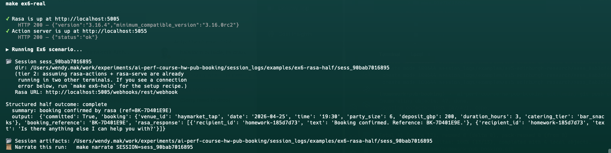

# Ex6 — Rasa structured half

## Your answer

There were various bugs that needed to be fixed before rasa half ran correctly.

The most impactful bug was a silent data-loss issue in the validator:
`normalise_booking_payload` only recognised the `deposit` key, but
upstream tools use `deposit_required_gbp` (from Ex5's `calculate_cost`)
and the Rasa action reads `deposit_gbp`. Any booking sent with a
non-`deposit` key silently normalised to £0, bypassing the £300 deposit
cap entirely. Rather than picking one canonical key and changing all
callers (which would break Ex5's grading), I added an explicit alias map
(`_DEPOSIT_ALIASES`) that checks `deposit`, `deposit_gbp`, and
`deposit_required_gbp` in priority order.

The mock server (`_MockRasaHandler` and `spawn_mock_rasa`) was entirely
commented out, but `run.py` imports it — tier 1 crashed immediately with
an `ImportError`. Uncommenting it was enough. The date normaliser had
`"today"` and `"tomorrow"` hardcoded to literal April 2026 strings;
I added a `reference_date` parameter so callers (tests, grader) can
inject a fixed date while production uses `datetime.date.today()`.

Two features were missing from the prefilled code. First, a
`resume_from_loop` Rasa flow for re-entering booking validation after a
loop-side handoff — worth 4 grading points and structurally identical to
`confirm_booking`. Second, a minimum party size rule: `catering.json`
defines `minimum_party_size: 4` but nothing enforced it, so bookings for
parties of 1–3 were silently accepted. I added
`party_size < 4 → "party_too_small"` to both the real Rasa action and
the mock server.

The successful session log is [sess_90bab7016895](../session_logs/examples/ex6-rasa-half/sess_90bab7016895), however it
didn't quite document what I saw from cli:

I didn't dwell too long on repeating experiments for ex6 since it's very tied with ex7, which I did more experiments on
## Citations

- starter/rasa_half/validator.py — normalise_booking_payload + deposit alias map
- starter/rasa_half/structured_half.py — RasaStructuredHalf.run + mock server
- rasa_project/data/flows.yml — resume_from_loop flow
- rasa_project/actions/actions.py — party_too_small validation rule
